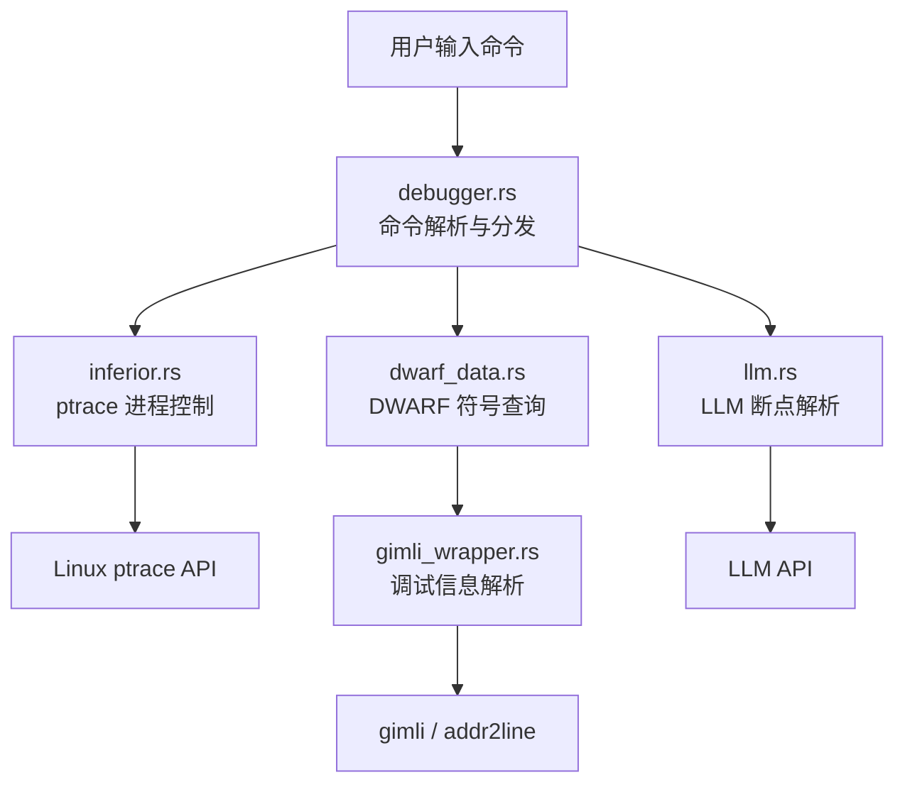

<p align="center">
  <h1 align="center">🐵 Kong-Debugger</h1>
  <p align="center">
    <strong>一个用 Rust 编写的轻量级 Linux 调试器</strong>
  </p>
  <p align="center">
    支持断点 · 单步执行 · 调用栈回溯 · 变量查看 · AI 自然语言断点
  </p>
</p>

---

Kong-Debugger（`kdb`）是一个面向 Linux 平台的命令行调试器，基于 `ptrace` 系统调用实现，提供类似 GDB 的核心调试能力。它能解析 DWARF 调试信息，支持源码级断点、变量检查和函数回溯，同时集成了 LLM 驱动的自然语言断点功能，让调试体验更加智能。

**Why Rust?**
在保证系统级性能的同时，本项目注重：
+ 内存安全：从根本上杜绝悬垂指针、内存泄漏、double free等问题
+ 并发安全：本项目采用**Multi-Process**编程的并发范式，相较于C语言多进程编程中较大的心智负担，rust提供了更完善和优秀的抽象

## ✨ 功能特性

### 核心调试功能

| 命令 | 别名 | 功能 |
|------|------|------|
| `run` | `r` | 启动或重启被调试程序 |
| `break <location>` | `b` | 设置断点（支持函数名、行号、地址） |
| `continue` | `c` / `cont` | 从断点处继续执行 |
| `next` | `n` | 源码级单步执行（Step Over） |
| `print <var>` | `p` | 打印当前作用域中的变量值和类型 |
| `backtrace` | `bt` / `back` | 显示完整的函数调用栈 |
| `quit` | `q` | 终止调试会话并退出 |

### 🤖 AI 自然语言断点

通过集成 LLM API，支持用自然语言描述来设置断点：

```
(kdb) nb 在段错误发生的地方打断点
[AI] 解析断点: func2
Set breakpoint 0 at 0x401156
```

| 命令 | 说明 |
|------|------|
| `nb <描述>` | 用自然语言描述断点位置，AI 自动解析为具体断点 |

### 断点设置方式

```
(kdb) b main          # 按函数名设置
(kdb) b 15            # 按源代码行号设置
(kdb) b *0x401156     # 按内存地址设置
```

## 🚀 快速开始

### 前置要求

- **Linux** 操作系统（需要 `ptrace` 系统调用支持）
- **Rust** 工具链（edition 2018+）
- **GCC** 编译器（用于编译目标 C 程序）

### 编译

```bash
# 克隆仓库
git clone https://github.com/your-username/kong-debugger.git
cd kong-debugger

# 编译调试器
cargo build

# 编译示例程序（自动附加调试符号）
make
```

### 运行

```bash
# 使用 cargo run
cargo run -- samples/segfault

# 或者直接运行编译后的二进制
./target/debug/deet samples/segfault
```

## 📖 使用示例

### 完整调试会话

```
$ cargo run -- samples/segfault

(kdb) b func2                    # 在 func2 函数入口设断点
Set breakpoint 0 at 0x401156

(kdb) r                          # 启动程序
Calling func2
Child stopped (signal SIGTRAP)
Stopped at func2 /path/to/segfault.c:3
3    void func2(int a) {

(kdb) n                          # 单步到下一行
Stopped at func2 /path/to/segfault.c:4
4        printf("About to segfault... a=%d\n", a);

(kdb) p a                        # 查看变量 a 的值
a = 2 (int)

(kdb) bt                         # 查看调用栈
func2: /path/to/segfault.c:4
func1: /path/to/segfault.c:11
main: /path/to/segfault.c:15

(kdb) c                          # 继续执行
Child received signal SIGSEGV
Child stopped (signal SIGSEGV)

(kdb) q                          # 退出调试器
Killing running inferior (pid 12345)
```

### 段错误调试

Kong-Debugger 可以捕获并报告段错误信号，帮助定位崩溃原因：

```
(kdb) r
Child received signal SIGSEGV     # 捕获段错误
(kdb) bt                          # 查看崩溃时的调用栈
func2: segfault.c:5
func1: segfault.c:11
main: segfault.c:15
```

## 🐳 Docker 支持

项目提供了 Docker 容器化运行方案，适用于没有 Linux 环境或需要隔离运行的场景：

```bash
# 构建 Docker 镜像
docker build -t deet .

# 通过容器脚本启动（自动处理 ptrace 权限）
./container bash

# 在容器内编译和运行
cargo build
cargo run -- samples/segfault
```

> **注意**：容器启动时会自动添加 `SYS_PTRACE` capability，以支持 `ptrace` 系统调用。

## 🔧 编译目标程序

被调试的目标程序需要包含完整的调试信息。推荐使用以下编译选项：

```bash
gcc -O0 -g -no-pie -fno-omit-frame-pointer -o program program.c
```

| 选项 | 说明 |
|------|------|
| `-O0` | 禁用优化，确保代码行为与源码一致 |
| `-g` | 生成 DWARF 调试信息 |
| `-no-pie` | 禁用地址随机化（PIE），保证地址固定 |
| `-fno-omit-frame-pointer` | 保留帧指针，`backtrace` 功能所需 |

项目自带的 `Makefile` 已经配置了这些选项，直接 `make` 即可编译所有示例程序。

## 📂 示例程序

`samples/` 目录下提供了多个测试用例：

| 文件 | 说明 | 测试场景 |
|------|------|----------|
| `hello.c` | Hello World | 基础运行和退出 |
| `count.c` | 循环打印 1-5 | 断点和单步执行 |
| `segfault.c` | 空指针解引用 | 信号捕获和崩溃诊断 |
| `function_calls.c` | 多层函数嵌套调用 | `backtrace` 和调用栈分析 |
| `sleepy_print.c` | 带 `sleep()` 的打印 | 长时间运行进程和中断处理 |
| `exit.c` | 指定退出码退出 | 退出状态检测 |

## 🏗️ 技术架构

### 项目结构

```
kong-debugger/
├── src/
│   ├── main.rs              # 入口：参数解析，信号处理
│   ├── debugger.rs           # 调试器主循环和命令分发
│   ├── debugger_command.rs   # 命令解析（字符串 → 枚举）
│   ├── inferior.rs           # 被调试进程管理（ptrace 交互）
│   ├── dwarf_data.rs         # DWARF 调试信息接口层
│   ├── gimli_wrapper.rs      # gimli 库底层封装
│   └── llm.rs                # LLM API 集成（自然语言断点）
├── samples/                  # 示例 C 程序
├── Cargo.toml                # Rust 依赖配置
├── Makefile                  # 示例程序编译规则
├── Dockerfile                # Docker 容器配置
├── llm_config.json           # LLM API 配置
└── container                 # Docker 容器启动脚本
```

### 核心实现原理



- **进程控制**：通过 `ptrace` 系统调用实现进程跟踪。子进程使用 `PTRACE_TRACEME` 启用被追踪模式，调试器通过 `PTRACE_CONT`、`PTRACE_SINGLESTEP`、`PTRACE_GETREGS` 等操作控制执行流程
- **软件断点**：向目标地址写入 `INT 3`（`0xCC`）指令，触发 `SIGTRAP` 信号。原始字节被保存用于恢复，支持断点的动态设置和移除
- **DWARF 解析**：使用 `gimli` 和 `addr2line` 库读取 ELF 文件中的调试信息，实现地址到源码行号、函数名的映射
- **变量读取**：通过 DWARF 位置描述（Location Description）定位变量在栈帧中的偏移，使用 `ptrace::read` 读取内存中的变量值
- **调用栈回溯**：沿帧指针（`RBP`）链遍历栈帧，配合 DWARF 信息还原每一层函数调用的源码位置
- **单步执行**：使用 `PTRACE_SINGLESTEP` 进行指令级单步，循环执行直到源代码行号发生变化，实现源码级的 Step Over

### 依赖项

| Crate | 用途 |
|-------|------|
| `nix` | 系统调用封装（ptrace, waitpid, signal） |
| `gimli` | DWARF 调试信息解析 |
| `addr2line` | 地址到源码位置的快速查询 |
| `object` | ELF 目标文件解析 |
| `memmap` | 内存映射文件读取 |
| `rustyline` | 交互式命令行（历史记录、行编辑） |
| `ureq` | HTTP 客户端（LLM API 调用） |
| `serde_json` | JSON 序列化/反序列化 |

## ⚙️ LLM 配置

自然语言断点功能需要配置 LLM API。在项目根目录创建 `llm_config.json`：

```json
{
    "api_key": "your-api-key",
    "api_base": "https://api.deepseek.com/v1",
    "model": "deepseek-chat"
}
```

支持任何兼容 OpenAI API 格式的服务（如 DeepSeek、OpenAI 等）。

## 📋 平台要求

- **操作系统**：Linux（依赖 `ptrace` 系统调用）
- **架构**：x86-64（依赖寄存器布局如 `RIP`、`RBP`）
- **Rust**：Edition 2018+
